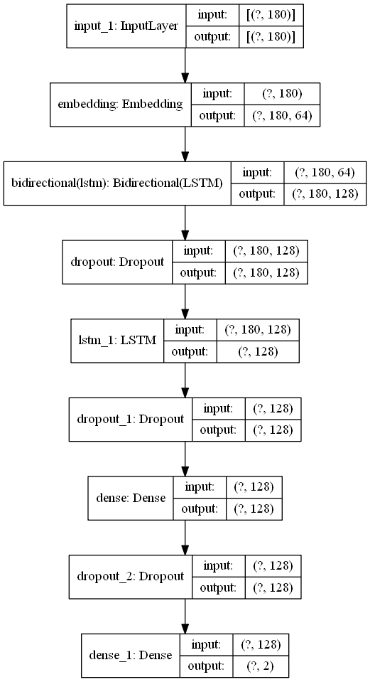

# Sentiment-Analysis LSTM using Embedding Technique
**Description** : Trained with over 60,000 IMDB dataset to categorized positive and negative review

**Algorithm Model** : Deep Learning method->> LSTM, Long Short Term Memory, BIdirectional 

**Preprocessing step** : TOKENIZER, PADDING, ONE HOT ENCODER

**Objective** : To produce outcome with accuracy 80%~85% range of prediction by model trained

**Flowchart Model** :

 

### Exploratory Data Analysis (EDA)
1) Data Loading
2) Data Inspection
3) Data Cleaning
4) Features Selection
5) Pre-Processing

**Model evaluation** :

`Classification_report`
`accuracy_score`
`Confusion_Matrix`
`Model_train_test_split`
`json`
`pickle`
`EDA`

**Discussion** :

 🟠The model is actually not learning so well after increasing neurons layer with only 0.54 accuracy
 
 🟠The graphs shows the model is underfitting to predict the outcome
 
 🟠Therefore, in order for model tuning, we use bidirectional and embedded layer to fit the model in order to improve the accuracy
 
 🟠After training, the results show 84% accuracy, recall 79%, f1 score 83% respectively
 
 🟠However, after plotting, the grapsh shows overfitting on 2nd epoch
 
 🟠To overcome this, early stopping can be introduced to prevent it
 
 🟠We can increase dropout rate to control overfitting
 
 🟠Other than that, can use other DL architecture like BERT model,transformer
 
 🟠GPT3 model may help to improve

**Dataset** :

[Datasets](https://raw.githubusercontent.com/Ankit152/IMDB-sentiment-analysis/master/IMDB-Dataset.csv)

**Enjoy!** 🚀

